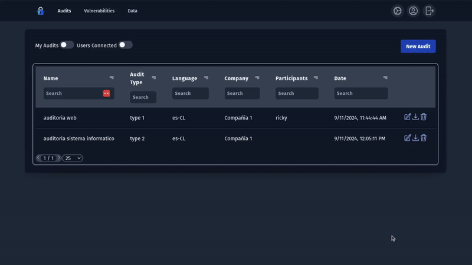
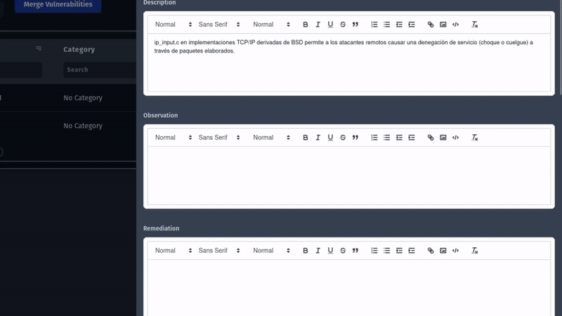
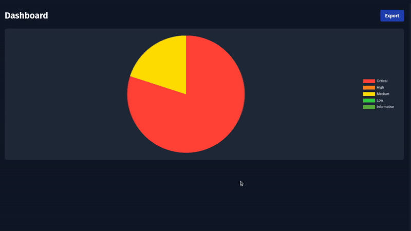
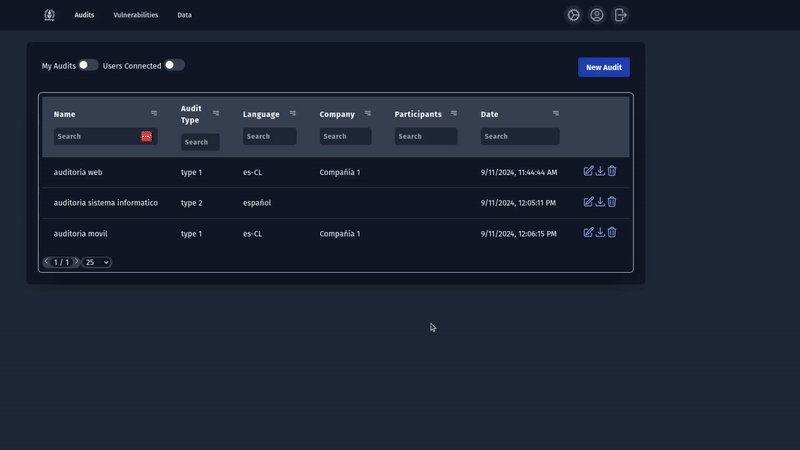
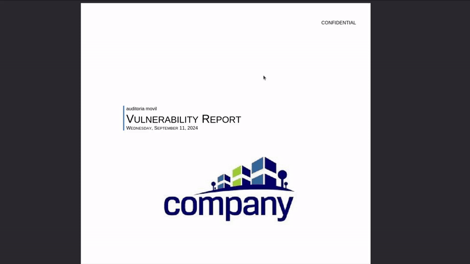

  

<h1 align="center">AuditForge</h1>

  
  
  

  AuditForge (PwnDoc fork) is a pentest reporting application making it simple and easy to write your findings and generate a customizable Docx report.  
  The main goal is to have more time to search vulnerabilities and less time to write documentation by mutualizing data like vulnerabilities between users.

  <a href="https://auditforge.feriadesoftware.cl">Website</a>

## Table of Contents
- [Features](#features)
- [Documentation](#documentation)
- [Our Team](#our-team)

## Features

- 🌐 Multiple Language support

- 🤖 CWE and CVSS recommendations powered by AI

- 📊 Dashboard generation

- 📁 Multiple Data support
- 🎨 Great Customization
  - Manage reusable Audit and Vulnerability Data
  - Create Custom Sections
  - Add custom fields to Vulnerabilities

- 🛠️ Vulnerabilities Management
- 👥 Multi-User reporting
- 📄 Docx and PDF Report Generation

- 📝 Docx Template customization

## Documentation

You can find the documentation [here](https://caverav.github.io/auditforge/).

## Activity

    

## Contributors

  

  

